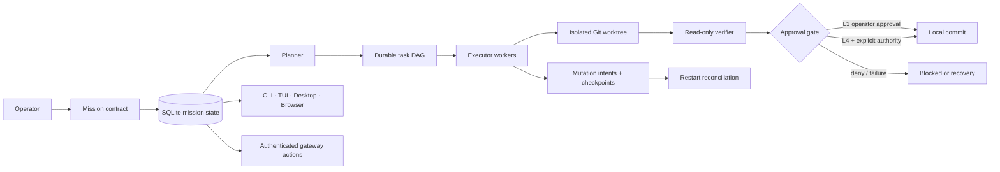

# Hermes Project Autopilot

[](https://github.com/piemasterflex111/hermes-project-autopilot/actions/workflows/integrity.yml)
[](https://github.com/piemasterflex111/hermes-project-autopilot/actions/workflows/integration-replay.yml)

**A restart-safe, evidence-gated autonomous repository mission system implemented for Hermes Agent.**

Project Autopilot converts a repository objective into a durable mission with an explicit contract, bounded autonomy, an isolated Git worktree, a dependency graph, mutation-intent recovery, independent verification, authenticated operator controls, and auditable evidence.

This repository preserves the complete five-commit implementation delivered on top of [`NousResearch/hermes-agent`](https://github.com/NousResearch/hermes-agent), plus exact source snapshots, apply-ready patches, architecture documentation, and fresh release evidence.

## The problem

A normal chat agent can lose context, declare success without proof, modify the wrong checkout, or resume incorrectly after a restart. Project Autopilot replaces conversational intent with durable state and fail-closed gates.

```text
objective
   ↓
contract + autonomy + scope
   ↓
isolated worktree + rollback ref
   ↓
planner → dependency graph
   ↓
executor tasks + mutation intents
   ↓
read-only verifier + deterministic commands
   ↓
operator approval or explicit L4 commit authority
   ↓
local commit only — never push, merge, deploy, or restart
```

## What was implemented

| Layer | Delivered capability |
|---|---|
| Durable state | SQLite mission contracts, roles, plans, task manifests, evidence, mutation intents, gateway subscriptions, and one-use actions |
| Repository isolation | Clean registered source checkout, dedicated Git worktree, branch, base commit, rollback ref, and Git identity checks |
| Autonomy | L0 advisory, L1 inspect, L2 prepare/plan, L3 execute with operator approval, L4 verified local commit only with separate authority |
| Execution containment | Allowed roots and paths, dedicated Docker workspace, detached-command rejection, offline-only v1 network policy |
| Recovery | Checkpoints, open mutation intents, restart reconciliation, lease quiescence, safe retry, cancellation, and verified rollback |
| Verification | Exact verification commands, non-empty diff, scope check, evidence hash-chain validation, independent verifier |
| Operator authorization | Expiring, one-use, SHA-256-hashed action capabilities bound to platform, chat, thread, scope, operator, mission, and action |
| Surfaces | CLI, slash commands, TUI Mission Center, desktop Mission Center, browser dashboard, and gateway-native controls |

## Architecture



See [Architecture](docs/architecture.md), [Lifecycle](docs/lifecycle.md), and [Security model](docs/security-model.md).

## Release evidence

Fresh verification against committed Hermes revision `a70c859e4`:

- **18 / 18 deterministic release scenarios passed**
- **0 failed scenarios**
- **0 safety escapes**
- **135 focused integration tests passed**
- Evidence hash chain, restart recovery, rollback, graph immutability, Docker containment, network fail-closed behavior, gateway replay prevention, identity binding, expiry, and detailed surfaces were covered

Artifacts:

- [`evidence/release-gate.json`](evidence/release-gate.json)
- [`evidence/focused-tests.txt`](evidence/focused-tests.txt)
- [`docs/release-evidence.md`](docs/release-evidence.md)

## Exact provenance

| Item | Value |
|---|---|
| Upstream | `https://github.com/NousResearch/hermes-agent.git` |
| Public replay base | `e444d165807f489b5c1ab8e4a612c8d09c2e67a2` |
| Required local prerequisite | `d8de415491a4935ad54021d10b2cc18f2c3d356b` |
| Final implementation commit | `a70c859e4aae7e4159522b1c2bc50ced165193e3` |
| Final Git tree | `7ba19cb3ce7b36f9b856b6290e247c050dc03ab3` |
| Authored commits | 5 |
| Exported integration files | 74 |

The CI integration-replay job clones upstream at the base commit, applies all five patches, and requires the resulting tree hash to equal the recorded final tree. This proves the patch series recreates the delivered implementation exactly.

## Repository layout

```text
hermes-project-autopilot/
├── hermes_integration/      # Exact committed files touched by the feature series
├── prerequisites/           # One local prerequisite patch after the public base
├── patches/                 # Five apply-ready Autopilot implementation patches
├── provenance/              # Commits, blob hashes, SHA-256 manifest, tree hashes
├── evidence/                # Fresh release-gate and focused-test outputs
├── docs/                    # Architecture, safety, lifecycle, authorization, surfaces
├── examples/                # Mission contract and operator workflow examples
├── scripts/                 # Integrity, privacy, and integration replay tooling
└── tests/                   # Repository-level provenance tests
```

## Verify this repository

```bash
./scripts/verify_repository.sh
```

That command verifies:

1. every exported file against its SHA-256 and Git blob ID;
2. the prerequisite and all five feature patches against their manifest;
3. the five-commit parent chain;
4. the release threshold (`18/18`, zero safety escapes);
5. privacy and credential scans;
6. repository-level tests.

## Replay the implementation into Hermes

```bash
./scripts/replay_integration.sh /tmp/hermes-autopilot-replay
```

The script clones Hermes Agent, checks out the exact base revision, applies the patch series, and verifies the final tree hash. It does not modify an existing Hermes installation.

For an existing compatible clone, follow [Integration and replay](docs/integration.md).

## Example mission

```bash
hermes mission create "Repair the parser" \
  --outcome "All parser tests pass without disabled tests" \
  --verify "pytest -q tests/parser" \
  --allowed-root /work/parser \
  --allowed-path src \
  --allowed-path tests \
  --autonomy 3 \
  --repo /work/parser \
  --project parser-project

hermes mission plan-auto m_abc123 --executor engineer --verifier reviewer
hermes mission start m_abc123
hermes mission verify m_abc123
hermes mission approve m_abc123
hermes mission commit m_abc123
```

## V1 boundaries

Project Autopilot v1 deliberately does **not**:

- push to a remote;
- merge branches;
- deploy software;
- restart services;
- modify the original source checkout;
- permit unrestricted network egress;
- treat an executor’s narrative as verification.

These are safety properties, not missing shortcuts.

## Status

This is an **integration subsystem repository**, not a fork or a misleading standalone replacement for Hermes Agent. The complete runtime depends on the upstream Hermes Kanban database, dispatcher, tools, gateway adapters, and UI applications. The patch series and exact source snapshot make the implementation reviewable and reproducible.

## License and attribution

Hermes Agent is MIT licensed. The preserved upstream files retain the Nous Research copyright notice. See [LICENSE](LICENSE) and [NOTICE.md](NOTICE.md).
