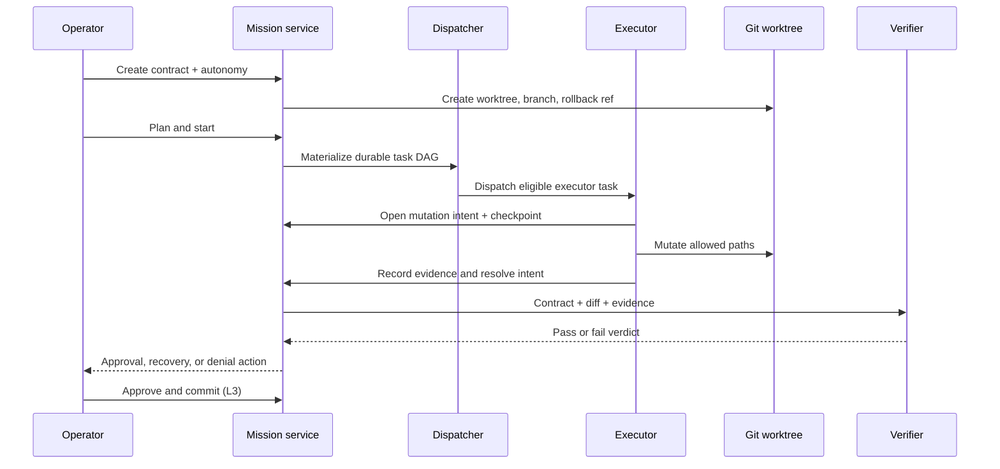

# Architecture

## First-principles model

A mission is not a chat session. It is a durable state machine whose authority is constrained by a contract.

### Contract

The contract records:

- objective and required outcome;
- exact verification commands;
- allowed roots and relative paths;
- network destination policy;
- autonomy level;
- local-commit authority;
- stop conditions and budgets.

### Durable control plane

The mission controller is the only authority allowed to change mission lifecycle state or structurally mutate mission-linked task cards. Clients call the controller; they do not duplicate policy.

### Data plane

Executor workers operate against a dedicated Git worktree. Before mutation, the system records an intent and checkpoint. Successful completion resolves the intent. A restart with an orphaned intent blocks instead of guessing filesystem state.

### Verification plane

The verifier receives the contract, diff, and evidence. It does not receive or trust the executor’s justification. Deterministic commands, scope checks, evidence-chain validity, and a non-empty diff are required at the commit boundary.

## Shared surfaces

CLI, slash commands, TUI, desktop, browser, and gateway controls consume the same mission report and action service. This prevents a user interface from inventing a transition that the backend would reject.
