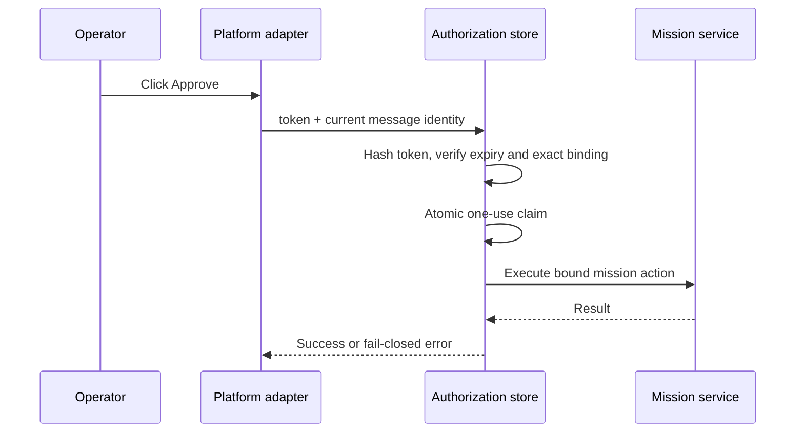

# Gateway authorization

Interactive controls are authorization capabilities, not decorative UI state.

## Issuance

1. An operator subscribes to a mission from a specific platform, chat, optional thread, workspace or guild scope, and stable principal identity.
2. When the mission reaches an actionable state, the watcher atomically claims that mission version for delivery.
3. A random opaque token is created for each valid action.
4. Only its SHA-256 hash and durable identity binding are stored.
5. The raw token is sent in a native button or authenticated text fallback.

## Redemption

A copied token does not transfer authority. Cross-user, cross-chat, cross-thread, expired, malformed, and replayed requests are rejected.
