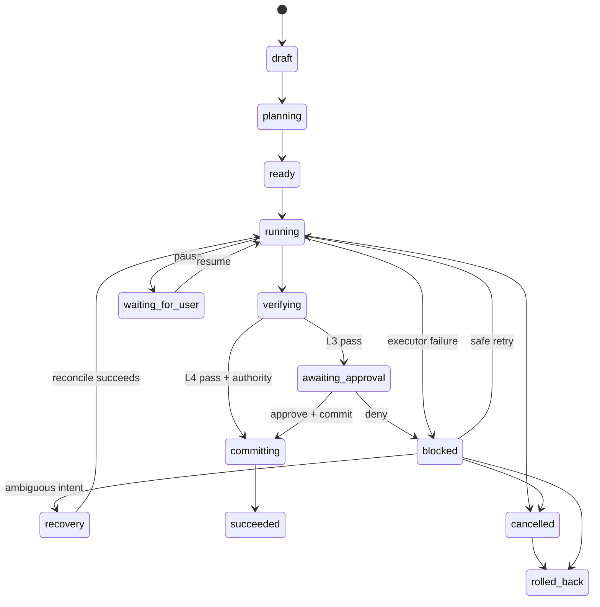

# Mission lifecycle

## Autonomy levels

| Level | Authority |
|---|---|
| L0 | Advisory only |
| L1 | Inspect registered repository |
| L2 | Prepare isolated worktree and plan |
| L3 | Execute and verify; operator approval and commit remain separate |
| L4 | Execute, verify, and create a local commit only when the contract separately grants local-commit authority |

## State progression

The exact transition table is defined in `hermes_integration/hermes_cli/missions_db.py` and enforced centrally.

## Safe retry

The final implementation commit fixed a critical control-plane issue: retrying an execution-phase mission must requeue the blocked executor card, not only change the mission row from `blocked` to `running`. The recurrence counter is preserved, so an unchanged failure escalates to triage instead of producing an infinite retry loop.
